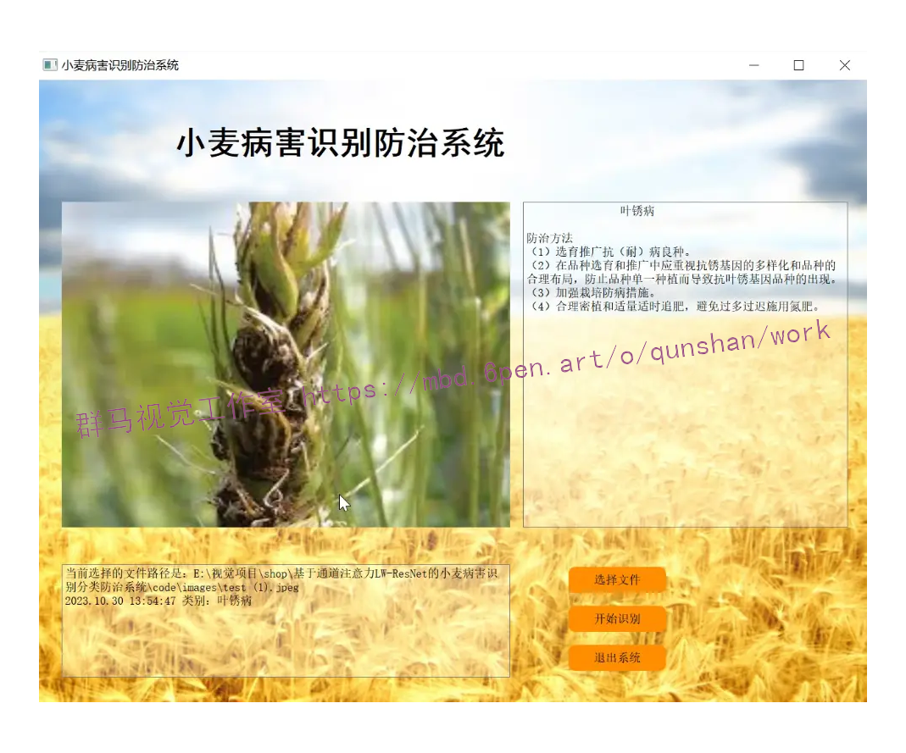

# 1.研究背景与意义


小麦是世界上最重要的粮食作物之一，但由于病害的侵袭，小麦产量和质量受到了严重的威胁。因此，开发一种高效准确的小麦病害识别分类防治系统对于保障粮食安全和农业可持续发展具有重要意义。

传统的小麦病害识别分类方法主要依赖于人工观察和经验判断，这种方法存在着识别效率低、准确性不高的问题。而随着计算机视觉和深度学习技术的快速发展，基于图像处理和机器学习的小麦病害识别分类方法逐渐成为研究热点。

近年来，深度学习在图像识别领域取得了显著的成果。然而，传统的深度卷积神经网络（CNN）在处理小麦病害图像时面临着一些挑战。首先，小麦病害图像通常具有复杂的纹理和形状特征，传统的CNN模型往往难以捕捉到这些细节信息。其次，小麦病害图像中的病害部分往往只占整个图像的一小部分，而传统的CNN模型往往会将整个图像作为输入，导致对病害部分的关注不足。

为了解决上述问题，本研究提出了一种基于通道注意力LW-ResNet的小麦病害识别分类防治系统。该系统主要包括两个关键部分：通道注意力机制和LW-ResNet模型。

通道注意力机制是一种自适应的注意力机制，它能够根据图像的内容自动调整各个通道的权重，从而使网络更加关注重要的特征。在小麦病害识别分类任务中，通道注意力机制可以帮助网络更好地捕捉到病害图像中的细节信息，提高识别准确性。

LW-ResNet模型是一种改进的残差网络模型，它结合了局部窗口和全局窗口的特征信息。在小麦病害识别分类任务中，LW-ResNet模型可以通过局部窗口和全局窗口的特征融合，提高网络对病害部分的关注度，进一步提高识别准确性。

该研究的意义主要体现在以下几个方面：

首先，基于通道注意力LW-ResNet的小麦病害识别分类防治系统可以提高小麦病害的识别准确性和分类效果，帮助农民及时采取相应的防治措施，减少病害对小麦产量和质量的影响。

其次，该系统可以提高小麦病害的识别效率，减轻人工观察和经验判断的负担，提高工作效率和决策准确性。

此外，该研究还可以为其他农作物的病害识别分类提供借鉴和参考，促进农业科技的发展和应用。

综上所述，基于通道注意力LW-ResNet的小麦病害识别分类防治系统具有重要的研究意义和应用价值，对于保障粮食安全、提高农业生产效益具有重要的推动作用。

# 2.图片演示



# 3.视频演示
[基于全局注意力的改进YOLOv7-AC的水下场景目标检测系统_哔哩哔哩_bilibili](https://www.bilibili.com/video/BV1Vc411f7Gq/?spm_id_from=333.999.0.0&vd_source=ff015de2d29cbe2a9cdbfa7064407a08)

# 4.LW-ResNet 网络模型
针对自然场景下苹果病害的特点以及移动设备存储空间和计算资源有限的应用需求基于ResNet18构建了改进的残差网络模型(LW-ResNet)，结构如图所示。

该网络在ResNet18的基础上，将每个Stage减少至1个残差模块，并且在残差模块中添加了多种感受野尺寸，降低模型的参数量与计算量并获取多种局部特征。设计池化层与卷积层串联的方式实现恒等映射，减少信息损失，加强病斑细节特征的表达。在残差模块间引入轻量注意力模块ECANet，抑制由复杂背景产生的环境噪声在模型学习过程中的传递。


# 5.核心代码讲解

#### 5.1 model.py
```python

class ECANet(nn.Module):
    def __init__(self, channels):
        super(ECANet, self).__init__()
        self.avg_pool = nn.AdaptiveAvgPool2d(1)
        self.conv = nn.Conv1d(1, 1, kernel_size=3, padding=1, bias=False)
        self.sigmoid = nn.Sigmoid()

    def forward(self, x):
        y = self.avg_pool(x)
        y = self.conv(y.squeeze(-1).transpose(-1, -2)).transpose(-1, -2).unsqueeze(-1)
        y = self.sigmoid(y)

        return x * y.expand_as(x)

class ResidualBlock(nn.Module):
    def __init__(self, in_channels, out_channels, stride=1):
        super(ResidualBlock, self).__init__()

        G = 16  # group count
        mid_channels = out_channels // 4

        self.conv1 = nn.Conv2d(in_channels, mid_channels, kernel_size=1, stride=stride, bias=False)
        self.bn1 = nn.BatchNorm2d(mid_channels)

        self.gconv1 = nn.Conv2d(mid_channels, mid_channels, kernel_size=1, groups=G, bias=False)
        self.gconv3 = nn.Conv2d(mid_channels, mid_channels, kernel_size=3, groups=G, padding=1, bias=False)
        self.gconv5 = nn.Conv2d(mid_channels, mid_channels, kernel_size=5, groups=G, padding=2, bias=False)
        self.gconv7 = nn.Conv2d(mid_channels, mid_channels, kernel_size=7, groups=G, padding=3, bias=False)

        self.conv2 = nn.Conv2d(mid_channels*4, out_channels, kernel_size=1, bias=False)
        self.bn2 = nn.BatchNorm2d(out_channels)

        self.relu = nn.ReLU(inplace=True)
        self.downsample = nn.Sequential(
            nn.MaxPool2d(3, stride=2, padding=1),
            nn.Conv2d(in_channels, out_channels, kernel_size=1, bias=False)
        ) if stride != 1 or in_channels != out_channels else None

    def forward(self, x):
        identity = x

        out = self.conv1(x)
        out = self.bn1(out)
        out = self.relu(out)

        g1 = self.gconv1(out)
        g3 = self.gconv3(out)
        g5 = self.gconv5(out)
        g7 = self.gconv7(out)
        out = torch.cat([g1, g3, g5, g7], dim=1)

        out = self.conv2(out)
        out = self.bn2(out)

        if self.downsample:
            identity = self.downsample(identity)

        out += identity
        out = self.relu(out)

        return out

class LWResNet(nn.Module):
    def __init__(self, num_classes=2):  # Assuming Binary Classification (Disease/Not Disease)
        super(LWResNet, self).__init__()

        self.conv = nn.Conv2d(3, 16, kernel_size=3, stride=1, padding=1, bias=False)
        self.bn = nn.BatchNorm2d(16)
        self.relu = nn.ReLU(inplace=True)
        self.maxpool = nn.MaxPool2d(kernel_size=3, stride=2, padding=1)

        self.stage1 = self._make_layer(16, 16, 1)
        self.stage2 = self._make_layer(16, 32, 2)
        self.stage3 = self._make_layer(32, 64, 2)
        self.stage4 = self._make_layer(64, 128, 2)

        self.ecanet1 = ECANet(16)
        self.ecanet2 = ECANet(32)
        self.ecanet3 = ECANet(64)
        self.ecanet4 = ECANet(128)

        self.avgpool = nn.AdaptiveAvgPool2d((1, 1))
        self.fc = nn.Linear(128, num_classes)
        self.softmax = nn.Softmax(dim=1)

    def _make_layer(self, in_channels, out_channels, stride):
        return ResidualBlock(in_channels, out_channels, stride)

    def forward(self, x):
        x = self.conv(x)
        x = self.bn(x)
        x = self.relu(x)
        x = self.maxpool(x)

        x = self.stage1(x)
        x = self.ecanet1(x)

        x = self.stage2(x)
        x = self.ecanet2(x)

        x = self.stage3(x)
        x = self.ecanet3(x)

        ......


```
1. ECANet类：
   - 初始化函数中，定义了avg_pool、conv和sigmoid层。
   - forward函数中，首先对输入进行平均池化操作，然后将结果经过一系列卷积操作，并使用sigmoid函数进行激活。最后将输入与激活后的结果相乘并返回。

2. ResidualBlock类：
   - 初始化函数中，定义了conv1、bn1、gconv1、gconv3、gconv5、gconv7、conv2、bn2、relu和downsample层。
   - forward函数中，首先将输入保存为identity，然后经过一系列卷积和激活操作，其中gconv1、gconv3、gconv5和gconv7是分组卷积操作。接着将这些操作的结果进行拼接，并经过一次卷积操作。如果downsample不为None，则对identity进行下采样操作。最后将identity与输出相加，并经过激活函数后返回。

3. LWResNet类：
   - 初始化函数中，定义了conv、bn、relu、maxpool、stage1、stage2、stage3、stage4、ecanet1、ecanet2、ecanet3、ecanet4、avgpool、fc和softmax层。
   - _make_layer函数用于生成ResidualBlock层。
   - forward函数中，首先经过一次卷积、批归一化和激活操作，然后进行最大池化。接着经过stage1、ecanet1、stage2、ecanet2、stage3、ecanet3、stage4和ecanet4的一系列操作。最后进行自适应平均池化、展平、全连接和softmax操作，并返回结果。

以上是对给定代码的逐文件分析，核心部分是ECANet、ResidualBlock和LWResNet类的定义和实现。

该程序文件名为model.py，主要包含了三个类：ECANet、ResidualBlock和LWResNet。

ECANet类是一个自定义的模块，包含了一个自适应平均池化层、一个一维卷积层和一个Sigmoid激活函数。该类的forward方法实现了特征图的通道注意力机制。

ResidualBlock类是一个残差块，包含了多个卷积层和批归一化层。该类的forward方法实现了残差连接和特征图的分组卷积。

LWResNet类是一个轻量级的ResNet模型，包含了多个卷积层、批归一化层、残差块和ECANet模块。该类的forward方法实现了模型的前向传播过程，包括卷积、池化、残差块、通道注意力和全连接层等操作。

该程序文件主要实现了一个轻量级的ResNet模型，并使用了通道注意力机制来提升模型的性能。

#### 5.2 train.py

```python

class CNN(nn.Module):
    def __init__(self):
        super(CNN, self).__init__()
        self.conv1 = nn.Conv2d(3, 64, kernel_size=7, stride=2, padding=3)
        self.bn1 = nn.BatchNorm2d(64)
        self.maxpool = nn.MaxPool2d(kernel_size=3, stride=2, padding=1)

        self.layer1 = nn.Sequential(RestNetBasicBlock(64, 64, 1),
                                    RestNetBasicBlock(64, 64, 1))
        self.ca = ChannelAttention(64)
        self.sa = SpatialAttention()

        self.layer2 = nn.Sequential(RestNetDownBlock(64, 128, [2, 1]),
                                    RestNetBasicBlock(128, 128, 1))

        self.layer3 = nn.Sequential(RestNetDownBlock(128, 256, [2, 1]),
                                    RestNetBasicBlock(256, 256, 1))

        self.layer4 = nn.Sequential(RestNetDownBlock(256, 512, [2, 1]),
                                    RestNetBasicBlock(512, 512, 1))
        self.spp = SPP()

        self.conv2 = nn.Conv2d(2048, 512, kernel_size=1)

        self.avgpool = nn.AdaptiveAvgPool2d(output_size=(1, 1))

        self.fc = nn.Linear(512, 6)

    def forward(self, x):
        out = self.conv1(x)
        out = self.layer1(out)
        out = self.ca(out) * out
        out = self.sa(out) * out
        out = self.layer2(out)
        out = self.layer3(out)
        out = self.layer4(out)
        out = self.spp(out)
        out = self.conv2(out)
        out = self.avgpool(out)
        out = out.reshape(x.shape[0], -1)
        out = self.fc(out)
        return out

......
```

这个程序文件名为train.py，主要功能是训练一个卷积神经网络模型来对图像进行分类。程序的主要步骤如下：

1. 导入所需的库和模块，包括numpy、pandas、torch、sklearn、matplotlib、torchvision等。
2. 定义数据集的路径和类别，包括训练集和测试集的路径。
3. 将原始图像按照类别分别复制到训练集和测试集的文件夹中。
4. 进行数据预处理，包括图像的缩放、裁剪、翻转、旋转、颜色调整等操作，并进行归一化处理。
5. 创建训练集和测试集的数据加载器，用于批量加载数据。
6. 定义卷积神经网络模型，包括基本的卷积块、下采样块、SPP模块、通道注意力模块和空间注意力模块等。
7. 将模型移动到GPU上（如果可用）。
8. 定义优化器、损失函数和学习率衰减策略。
9. 进行模型训练，包括多个epoch的循环，每个epoch中进行前向传播、计算损失、反向传播和参数更新。
10. 保存训练好的模型。
11. 绘制训练过程中的损失和准确率曲线。

总体来说，这个程序文件实现了一个卷积神经网络模型的训练过程，用于对图像进行分类。

#### 5.3 ui.py

```python


class RestNetBasicBlock(nn.Module):
    def __init__(self, in_channels, out_channels, stride):
        super(RestNetBasicBlock, self).__init__()
        self.conv1 = nn.Conv2d(in_channels, out_channels, kernel_size=3, stride=stride, padding=1)
        self.bn1 = nn.BatchNorm2d(out_channels)
        self.conv2 = nn.Conv2d(out_channels, out_channels, kernel_size=3, stride=stride, padding=1)
        self.bn2 = nn.BatchNorm2d(out_channels)

    def forward(self, x):
        output = self.conv1(x)
        output = F.relu(self.bn1(output))
        output = self.conv2(output)
        output = self.bn2(output)
        return F.relu(x + output)


class RestNetDownBlock(nn.Module):
    def __init__(self, in_channels, out_channels, stride):
        super(RestNetDownBlock, self).__init__()
        self.conv1 = nn.Conv2d(in_channels, out_channels, kernel_size=3, stride=stride[0], padding=1)
        self.bn1 = nn.BatchNorm2d(out_channels)
        self.conv2 = nn.Conv2d(out_channels, out_channels, kernel_size=3, stride=stride[1], padding=1)
        self.bn2 = nn.BatchNorm2d(out_channels)
        self.extra = nn.Sequential(
            nn.Conv2d(in_channels, out_channels, kernel_size=1, stride=stride[0], padding=0),
            nn.BatchNorm2d(out_channels)
        )

    def forward(self, x):
        extra_x = self.extra(x)
        output = self.conv1(x)
        out = F.relu(self.bn1(output))

        out = self.conv2(out)
        out = self.bn2(out)
        return F.relu(extra_x + out)


class SPP(nn.Module):
    def __init__(self):
        super(SPP, self).__init__()
        self.pool1 = nn.MaxPool2d(kernel_size=5,stride=1,padding=5 // 2)
        self.pool2 = nn.MaxPool2d(kernel_size=7, stride=1, padding=7 // 2)
        self.pool3 = nn.MaxPool2d(kernel_size=13, stride=1, padding=13 // 2)
    def forward(self,x):
        x1 = self.pool1(x)
        x2 = self.pool2(x)
        x3 = self.pool3(x)
        return torch.cat([x,x1,x2,x3],dim=1)


class ChannelAttention(nn.Module):
    def __init__(self, in_planes, ratio=16):
        super(ChannelAttention, self).__init__()
        self.avg_pool = nn.AdaptiveAvgPool2d(1)
        self.max_pool = nn.AdaptiveMaxPool2d(1)

        self.fc1   = nn.Conv2d(in_planes, in_planes // 16, 1, bias=False)
        self.relu1 = nn.ReLU()
        self.fc2   = nn.Conv2d(in_planes // 16, in_planes, 1, bias=False)

        self.sigmoid = nn.Sigmoid()

    def forward(self, x):
        avg_out = self.fc2(self.relu1(self.fc1(self.avg_pool(x))))
        max_out = self.fc2(self.relu1(self.fc1(self.max_pool(x))))
        out = avg_out + max_out
        return self.sigmoid(out)

class SpatialAttention(nn.Module):
    def __init__(self, kernel_size=7):
        super(SpatialAttention, self).__init__()

        assert kernel_size in (3, 7), 'kernel size must be 3 or 7'
        padding = 3 if kernel_size == 7 else 1

        self.conv1 = nn.Conv2d(2, 1, kernel_size, padding=padding, bias=False)
        self.sigmoid = nn.Sigmoid()

    def forward(self, x):
        avg_out = torch.mean(x, dim=1, keepdim=True)
        max_out, _ = torch.max(x, dim=1, keepdim=True)
        x = torch.cat([avg_out, max_out], dim=1)
        x = self.conv1(x)
        return self.sigmoid(x)

......

```
ui.py是一个用于图像分类的程序文件。它使用了PyTorch库来构建一个卷积神经网络模型，并使用训练好的模型权重进行图像分类。程序文件中还包含了一些辅助函数和类，用于数据预处理、图像显示和结果输出等功能。程序通过读取输入的图像文件路径，将图像进行预处理后输入到模型中进行分类，并将分类结果输出到界面上。

# 6.系统整体结构
该工程是一个图像分类的项目，主要包含三个程序文件：model.py、train.py和ui.py。

model.py文件定义了卷积神经网络模型的结构，包括ECANet、ResidualBlock和LWResNet三个类。ECANet类实现了通道注意力机制，ResidualBlock类实现了残差连接，LWResNet类是一个轻量级的ResNet模型。

train.py文件用于训练模型，包括数据预处理、模型构建、模型训练和保存等功能。它使用了训练集和测试集的图像数据进行训练，并保存训练好的模型权重。

ui.py文件是一个图像分类的界面程序，它使用了训练好的模型权重进行图像分类。它通过读取输入的图像文件路径，将图像进行预处理后输入到模型中进行分类，并将分类结果输出到界面上。

下面是每个文件的功能整理：

| 文件名 | 功能 |
| --- | --- |
| model.py | 定义卷积神经网络模型的结构，包括ECANet、ResidualBlock和LWResNet三个类 |
| train.py | 进行模型的训练，包括数据预处理、模型构建、模型训练和保存等功能 |
| ui.py | 图像分类的界面程序，使用训练好的模型权重进行图像分类，包括图像预处理、模型加载和分类结果输出等功能 |

# 7.多尺度特征提取层
小麦病害识别的难点之一是病斑大小不同，尤其是识别小病斑。由于病斑细节特征的丰富性与其所占像素数成正比[6]，微小病斑特征不易提取，从而导致模型整体识别精度的下降。对于ResNet18来说，残差模块中只有尺寸为3x3的卷积层，单一尺度的卷积核感受野是固定的，提取到的特征有限，无法满足识别不同尺寸病斑特别是微小病斑所需的特征信息，还需联合多个尺度的特征进行鉴别。
然而使用传统的卷积核获取多尺度特征的同时也导致了网络的参数需求大大增加增加了模型训练与部署的难度。所以AAAI提出的模型选择参数量与复杂度较低的群卷积构建多尺度特征提取层。将ResNet18的残差模块中的第二层卷积替换为4种不同尺度(1×1、3×3、5×5、7×7）的群卷积，实现不同尺度特征的提取[5]。
群卷积操作如图所示，群卷积将尺寸为HxWxM的特征图分为G组，每组的输入通道数为MIG，每组的输出通道数为NG，卷积核总数为N。

以LW-ResNet的Stagel中的残差模块为例，多尺度特征提取层中每个卷积(1×1，3×3，5×5，7x7）的输入通道为16，输出通道为16，特征图输入和输出的尺寸为56×56。
传统卷积构造的多尺度特征提取层的参数量为12×16×16+32×16×16+52×16×16+72×16×16=21504。
组数为16 ( G=16 ）的群卷积构建的多尺度特征提取层的参数数量为12×16×16×1/16+32×16×16×1/16+52×16×16×1/16+7×16×16×1/16=1344，与传统卷积相比参数数量减少了93.75%。


同理，由公式可以计算出，传统卷积构造的多尺度特征提取层的FLOPs为6.74E+07，而群卷积构造的多尺度特征提取层的FLOPs为4.21E+06。

# 8.轻量高效的通道注意力模块
由于AAAI提供的数据集使用的图像为田间环境下的小麦叶部病害图像，背景复杂，存在诸多环境干扰因素。干扰因素产生的噪声会在模型学习过程中传递，随着网络的加深，噪声信息在特征图的权重也不断增加[6]，最终对模型的学习效果产生负面影响。通道注意力机制削弱代表背景特征的通道并减少它们的权重[8]，从而降低噪声等干扰因素对模型识别任务的负面影响。
而大多数通道注意力模块不能同时考虑低复杂性和高性能[9]。例如，经典的SENet模块t0I使用两个全连接层在通道之间交换信息和降低特征维数。全连接层的使用使SENet模块不具备轻量的特点，降维操作使得通道与其预测值没有直接关系，这对 SENet的整体性能有所影响。
ECANet利用一维卷积结合相邻通道获得加权的病斑特征，弥补特征降维带来的缺陷，实现局部交互，更好地增强病斑区域的特征。此外，ECANet的参数量和复杂度较低，不会过多增加网络模型的存储开销和计算开销。ECANet适合引入到轻量级网络结构中以提高模型在复杂环境下关注有效特征的能力，并保持模型的轻量和快速的特性。因此，本章将低复杂度、高效率的ECANet放置在每个残差模块后，通过对残差模块产生的通道特征重新校准，提高模型的表达能力，最终达到提高模型识别性能的目标。
ECANet结构如图所示，其中W为特征图的宽度，H为特征图的高度，C为通道数量，U代表原始，GAP代表全局平均池化操作，K既代表一维卷积的卷积核大小，也代表局部跨通道交流的范围，ü为加权后特征。


# 9.系统整合

下图[完整源码＆环境部署视频教程＆自定义UI界面](https://s.xiaocichang.com/s/97da1c)


参考博客[《基于通道注意力LW-ResNet的小麦病害识别分类防治系统》](https://mbd.pub/o/qunshan/work)

# 10.参考文献
---
[1][王鑫鹏](https://s.wanfangdata.com.cn/paper?q=%E4%BD%9C%E8%80%85:%22%E7%8E%8B%E9%91%AB%E9%B9%8F%22),[王晓强](https://s.wanfangdata.com.cn/paper?q=%E4%BD%9C%E8%80%85:%22%E7%8E%8B%E6%99%93%E5%BC%BA%22),[林浩](https://s.wanfangdata.com.cn/paper?q=%E4%BD%9C%E8%80%85:%22%E6%9E%97%E6%B5%A9%22),等.[深度学习典型目标检测算法的改进综述](https://d.wanfangdata.com.cn/periodical/jsjgcyyy202206005)[J].[计算机工程与应用](https://sns.wanfangdata.com.cn/perio/jsjgcyyy).2022,58(6).DOI:10.3778/j.issn.1002-8331.2110-0070 .

[2][刘汉卿](https://s.wanfangdata.com.cn/paper?q=%E4%BD%9C%E8%80%85:%22%E5%88%98%E6%B1%89%E5%8D%BF%22),[康晓东](https://s.wanfangdata.com.cn/paper?q=%E4%BD%9C%E8%80%85:%22%E5%BA%B7%E6%99%93%E4%B8%9C%22),[李博](https://s.wanfangdata.com.cn/paper?q=%E4%BD%9C%E8%80%85:%22%E6%9D%8E%E5%8D%9A%22),等.[利用深度学习网络对医学影像分类识别的比较研究](https://d.wanfangdata.com.cn/periodical/jsjkx2021z1016)[J].[计算机科学](https://sns.wanfangdata.com.cn/perio/jsjkx).2021,(z1).DOI:10.11896/jsjkx.201000116 .

[3][翟肇裕](https://s.wanfangdata.com.cn/paper?q=%E4%BD%9C%E8%80%85:%22%E7%BF%9F%E8%82%87%E8%A3%95%22),[曹益飞](https://s.wanfangdata.com.cn/paper?q=%E4%BD%9C%E8%80%85:%22%E6%9B%B9%E7%9B%8A%E9%A3%9E%22),[徐焕良](https://s.wanfangdata.com.cn/paper?q=%E4%BD%9C%E8%80%85:%22%E5%BE%90%E7%84%95%E8%89%AF%22),等.[农作物病虫害识别关键技术研究综述](https://d.wanfangdata.com.cn/periodical/nyjxxb202107001)[J].[农业机械学报](https://sns.wanfangdata.com.cn/perio/nyjxxb).2021,(7).DOI:10.6041/j.issn.1000-1298.2021.07.001 .

[4][刘阳](https://s.wanfangdata.com.cn/paper?q=%E4%BD%9C%E8%80%85:%22%E5%88%98%E9%98%B3%22),[高国琴](https://s.wanfangdata.com.cn/paper?q=%E4%BD%9C%E8%80%85:%22%E9%AB%98%E5%9B%BD%E7%90%B4%22).[采用改进的SqueezeNet模型识别多类叶片病害](https://d.wanfangdata.com.cn/periodical/nygcxb202102022)[J].[农业工程学报](https://sns.wanfangdata.com.cn/perio/nygcxb).2021,(2).DOI:10.11975/j.issn.1002-6819.2021.2.022 .

[5][王东方](https://s.wanfangdata.com.cn/paper?q=%E4%BD%9C%E8%80%85:%22%E7%8E%8B%E4%B8%9C%E6%96%B9%22),[汪军](https://s.wanfangdata.com.cn/paper?q=%E4%BD%9C%E8%80%85:%22%E6%B1%AA%E5%86%9B%22).[基于迁移学习和残差网络的农作物病害分类](https://d.wanfangdata.com.cn/periodical/nygcxb202104024)[J].[农业工程学报](https://sns.wanfangdata.com.cn/perio/nygcxb).2021,(4).DOI:10.11975/j.issn.1002-6819.2021.04.024 .

[6][樊湘鹏](https://s.wanfangdata.com.cn/paper?q=%E4%BD%9C%E8%80%85:%22%E6%A8%8A%E6%B9%98%E9%B9%8F%22),[周建平](https://s.wanfangdata.com.cn/paper?q=%E4%BD%9C%E8%80%85:%22%E5%91%A8%E5%BB%BA%E5%B9%B3%22),[许燕](https://s.wanfangdata.com.cn/paper?q=%E4%BD%9C%E8%80%85:%22%E8%AE%B8%E7%87%95%22),等.[基于改进卷积神经网络的复杂背景下玉米病害识别](https://d.wanfangdata.com.cn/periodical/nyjxxb202103023)[J].[农业机械学报](https://sns.wanfangdata.com.cn/perio/nyjxxb).2021,(3).DOI:10.6041/j.issn.1000-1298.2021.03.023 .

[7][黄林生](https://s.wanfangdata.com.cn/paper?q=%E4%BD%9C%E8%80%85:%22%E9%BB%84%E6%9E%97%E7%94%9F%22),[罗耀武](https://s.wanfangdata.com.cn/paper?q=%E4%BD%9C%E8%80%85:%22%E7%BD%97%E8%80%80%E6%AD%A6%22),[杨小冬](https://s.wanfangdata.com.cn/paper?q=%E4%BD%9C%E8%80%85:%22%E6%9D%A8%E5%B0%8F%E5%86%AC%22),等.[基于注意力机制和多尺度残差网络的农作物病害识别](https://d.wanfangdata.com.cn/periodical/nyjxxb202110027)[J].[农业机械学报](https://sns.wanfangdata.com.cn/perio/nyjxxb).2021,(10).DOI:10.6041/j.issn.1000-1298.2021.10.027 .

[8][帖军](https://s.wanfangdata.com.cn/paper?q=%E4%BD%9C%E8%80%85:%22%E5%B8%96%E5%86%9B%22),[罗均](https://s.wanfangdata.com.cn/paper?q=%E4%BD%9C%E8%80%85:%22%E7%BD%97%E5%9D%87%22),[郑禄](https://s.wanfangdata.com.cn/paper?q=%E4%BD%9C%E8%80%85:%22%E9%83%91%E7%A6%84%22),等.[基于改进残差网络的柑橘病害识别](https://d.wanfangdata.com.cn/periodical/znmzxyxb-zrkx202106012)[J].[中南民族大学学报（自然科学版）](https://sns.wanfangdata.com.cn/perio/znmzxyxb-zrkx).2021,40(6).DOI:10.12130/znmdzk.20210612 .

[9][孙俊](https://s.wanfangdata.com.cn/paper?q=%E4%BD%9C%E8%80%85:%22%E5%AD%99%E4%BF%8A%22),[朱伟栋](https://s.wanfangdata.com.cn/paper?q=%E4%BD%9C%E8%80%85:%22%E6%9C%B1%E4%BC%9F%E6%A0%8B%22),[罗元秋](https://s.wanfangdata.com.cn/paper?q=%E4%BD%9C%E8%80%85:%22%E7%BD%97%E5%85%83%E7%A7%8B%22),等.[基于改进MobileNet-V2的田间农作物叶片病害识别](https://d.wanfangdata.com.cn/periodical/nygcxb202122018)[J].[农业工程学报](https://sns.wanfangdata.com.cn/perio/nygcxb).2021,37(22).DOI:10.11975/j.issn.1002-6819.2021.22.018 .

[10][周薇娜](https://s.wanfangdata.com.cn/paper?q=%E4%BD%9C%E8%80%85:%22%E5%91%A8%E8%96%87%E5%A8%9C%22),[孙丽华](https://s.wanfangdata.com.cn/paper?q=%E4%BD%9C%E8%80%85:%22%E5%AD%99%E4%B8%BD%E5%8D%8E%22),[徐志京](https://s.wanfangdata.com.cn/paper?q=%E4%BD%9C%E8%80%85:%22%E5%BE%90%E5%BF%97%E4%BA%AC%22).[复杂环境下多尺度行人实时检测方法](https://d.wanfangdata.com.cn/periodical/dzkxxk202107035)[J].[电子与信息学报](https://sns.wanfangdata.com.cn/perio/dzkxxk).2021,(7).DOI:10.11999/JEIT200436 .


---
#### 如果您需要更详细的【源码和环境部署教程】，除了通过【系统整合】小节的链接获取之外，还可以通过邮箱以下途径获取:
#### 1.请先在GitHub上为该项目点赞（Star），编辑一封邮件，附上点赞的截图、项目的中文描述概述（About）以及您的用途需求，发送到我们的邮箱
#### sharecode@yeah.net
#### 2.我们收到邮件后会定期根据邮件的接收顺序将【完整源码和环境部署教程】发送到您的邮箱。
#### 【免责声明】本文来源于用户投稿，如果侵犯任何第三方的合法权益，可通过邮箱联系删除。